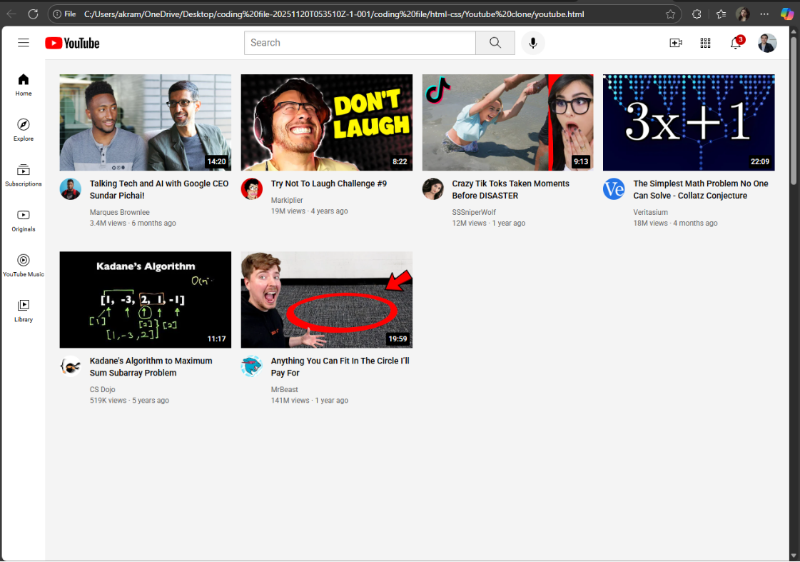

# YouTube Clone

A responsive front-end clone of the YouTube homepage built using HTML and CSS. This project was created to strengthen my understanding of modern web design, page layouts, and responsive user interfaces.

## Preview



## Features

- Responsive homepage layout
- Navigation sidebar
- Header with search functionality design
- Video thumbnail grid
- Channel information section
- Clean and organized UI structure

## Technologies Used

- HTML5
- CSS3

## Project Structure

```text
youtube-clone/
│
├── index.html
├── css/
│   └── style.css
├── images/
├── screenshots/
└── README.md
```

## Learning Outcomes

Through this project, I learned:

- HTML page structuring
- CSS Flexbox
- CSS Grid Layout
- Responsive web design
- UI cloning and layout recreation
- Front-end development best practices

## Future Improvements

- Add JavaScript functionality
- Implement dark mode
- Create video detail pages
- Add mobile navigation menu
- Connect to YouTube API

## Author

Akram Jha

Computer Science Graduate
